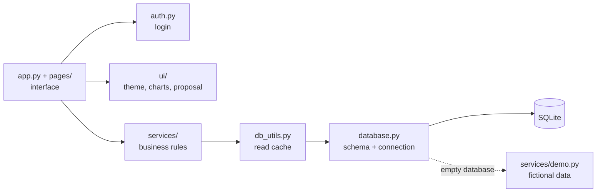

**English** · [Português](README.pt-BR.md)

# Claquete CRM/ERP

**CRM and back office for small video production companies: clients, projects, quotes and proposals, partner contributions, cash flow, fixed costs, equipment, team tasks and an automatic P&L (DRE). Built with Python, Streamlit and SQLite.**

[](https://claquete-crm.streamlit.app)


> **Fictional data.** This is the public version of a system in daily use at a three-partner video production company. The company name, brand, partners, clients, e-mails, phone numbers and every amount were replaced with data generated by [`services/demo.py`](services/demo.py). No client information is in this repository.

> **The interface is in Brazilian Portuguese**, because the system was built for a Brazilian company (currency in R$, dates as DD/MM/YYYY, Brazilian tax terms). This README is in English; the code comments are in Portuguese.

## Live demo

**[Open the demo](https://claquete-crm.streamlit.app)**

| User | Password |
|---|---|
| `demo` | `claquete` |

Feel free to create, edit and delete anything. The database resets to its initial state every time the server restarts.

If nobody has opened the demo in a while, Streamlit shows a *"This app has gone to sleep"* screen. Click **Yes, get this app back up!** and wait about 30 seconds.

---

## The problem

The company was run from a spreadsheet and a group chat. Three partners were paying company expenses out of their own pockets, nobody knew how much the company owed each of them, quotes were rebuilt by hand for every client, and the real monthly profit was a guess.

## The solution

A single web app the partners open from any browser. Every contribution, payment, cost and project is recorded once, and the system builds the rest on its own: what the company owes each partner, cash balance, receivables, fixed-cost bills for each month, the P&L and printable client proposals.

## Features

| Screen | What it does |
|---|---|
| **Dashboard** | Cash balance, period inflows and outflows, receivables, debt to partners, 12-month cash chart, spending by category, revenue by client and project funnel. |
| **Team agenda** | Task board by status, upcoming deadlines and workload per partner. "Overdue" is computed from the deadline, never stored. |
| **Partners & contributions** | Cash contributions, expenses paid out of pocket and reimbursements. Each partner's outstanding balance is always up to date. |
| **Clients & projects** | Lightweight CRM: clients, projects with status, installment payments and links to contracts and invoices. |
| **Quotes** | Hours × people × rate, with a price table, discount and effective hourly rate. Generates a print-ready A4 proposal (HTML → PDF). |
| **Cash flow** | Single ledger for every real inflow and outflow, with manual entries and filters. |
| **Fixed costs** | Recurring costs, monthly bills generated automatically, paid/unpaid tracking. |
| **Investments** | Equipment and software purchases, paid by the company or by a partner (which becomes a contribution to reimburse). |
| **P&L (DRE)** | Cash-basis income statement per month and year, with margin, and a warning when the margin suggests costs are missing. |

<table>
<tr>
<td></td>
<td></td>
</tr>
<tr>
<td></td>
<td></td>
</tr>
</table>

More screenshots in [`docs/`](docs/).

---

## Technical decisions

### Read cache with invalidation on write
Streamlit reruns the whole page on every click. In production the database is hosted in the cloud, so each query is a network round trip. Every read goes through [`db_utils.py`](db_utils.py), which keeps results in server memory. The rule that keeps data correct is simple: **any write (insert, update, delete) clears the entire cache**. The app runs on a single server shared by all partners, so a change made by one of them shows up for everyone on the next click. A 90-second expiry covers changes made outside the app. Results are deep-copied on the way in and out, so a page that adds fields to a result never corrupts the cached value.

Along with that: the connection is reused per thread and renewed after 45 seconds idle (no "ping" before each query), queries that used to run in loops were grouped (P&L, partner balances, quotes), and the schema check runs once per process.

### Proposals frozen by version
Issuing a proposal stores a **frozen copy of the full HTML document** in `propostas_emitidas`, with a version number. If the quote changes later, the proposal the client received stays in the history exactly as it was sent, and a new issue becomes revision 2, 3… The logo is replaced with a marker before saving, so it is not duplicated in every row.

### XSS protection
Several screens build HTML to apply the visual identity. All text that comes from the database or from a user goes through `theme.esc()` (`html.escape`) before reaching `unsafe_allow_html`, and the proposal document escapes every field the same way. Links to documents only accept `http://` and `https://` after normalization, so `javascript:` and `data:` links are rejected. The full review is in [`SEGURANCA.md`](SEGURANCA.md) (Portuguese).

### Passwords hashed with PBKDF2
Passwords are never stored. [`auth.py`](auth.py) keeps a `pbkdf2_sha256` hash with 200,000 iterations and a random salt per password, and compares with `hmac.compare_digest` (constant time). Sessions expire after 4 hours of inactivity, and the login locks after 5 failed attempts. Even the demo password goes through the same path: it is hashed once at startup and the login compares hashes.

### Other decisions
- **Business rules in `services/`**, pages only handle the interface. The services are plain Python and can be used from scripts (see `scripts/gerar_custos_do_mes.py`).
- **Schema changes that work on existing data:** `CREATE TABLE IF NOT EXISTS` plus a list of added columns applied with `ALTER TABLE` (idempotent).
- **Cash-basis P&L:** partner contributions and reimbursements are shown apart, as financing, not operating result.
- **Self-resetting demo:** when the database opens empty, `init_db()` loads the demo data under a lock (so two sessions starting together don't seed twice). Streamlit Community Cloud wipes the disk on restart, so the demo resets on its own. Demo dates are relative to today, so it always opens with current numbers.
- **Pinned dependencies** in `requirements.txt`, so the demo doesn't break on a library release.

## Architecture



## Run it locally

Requires Python 3.11 or newer.

```bash
git clone https://github.com/alissonlittig/claquete-crm.git
cd claquete-crm
python -m venv venv
# Windows: venv\Scripts\activate    |    Mac/Linux: source venv/bin/activate
pip install -r requirements.txt
streamlit run app.py
```

Open `http://localhost:8501` and sign in with `demo` / `claquete`. The database (`data/claquete_demo.db`) is created and filled on first run. To reset it at any time:

```bash
python scripts/seed_demo.py
```

To use your own passwords instead of the demo login, generate a hash with `python scripts/gerar_senha.py` and follow [`.streamlit/secrets.toml.example`](.streamlit/secrets.toml.example).

## Project structure

```
app.py                 dashboard (home page)
pages/                 one file per screen
services/              business rules (partners, projects, finance, P&L, quotes, tasks, demo data)
ui/                    theme, Plotly charts, form components, proposal document
database.py            schema, connection, migrations
db_utils.py            query helpers, read cache, BR formatting
auth.py                login, PBKDF2 hashing, session expiry
scripts/               seed, password hash, logo generator, monthly fixed costs
docs/                  screenshots
```

The Claquete logo is generated by code ([`scripts/gerar_logo.py`](scripts/gerar_logo.py)), with no source image.
