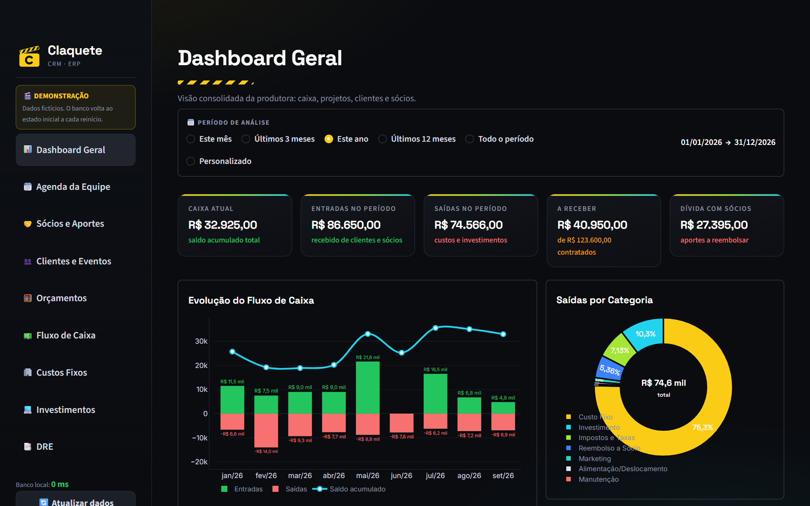
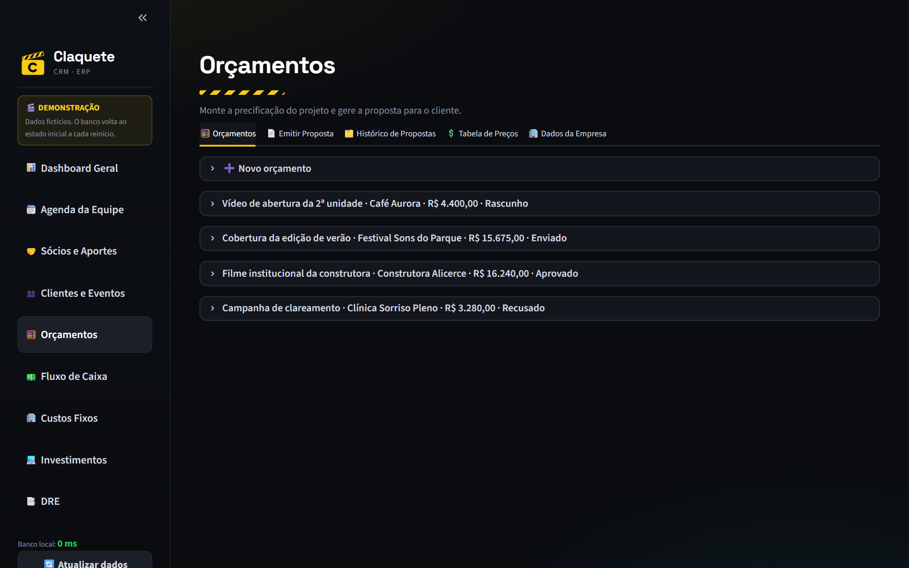
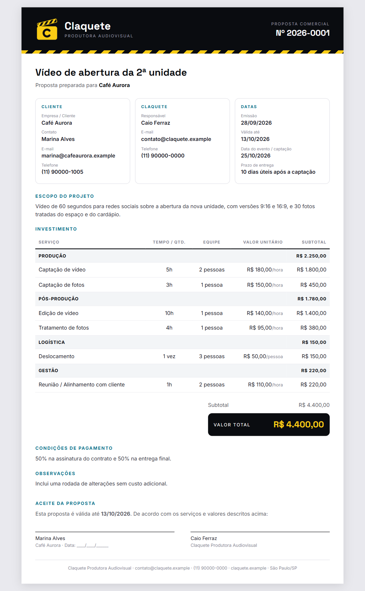
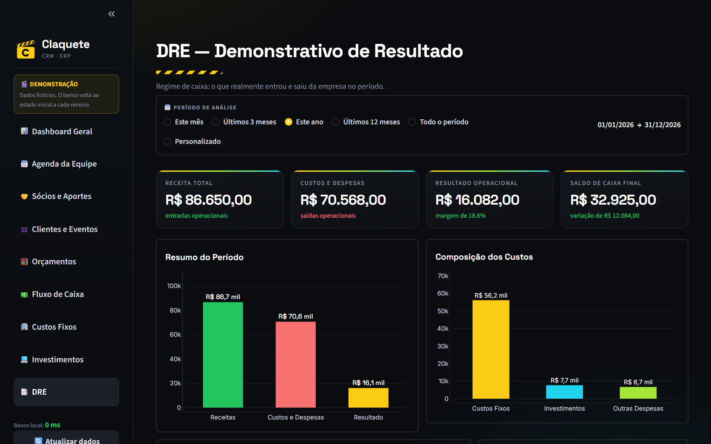
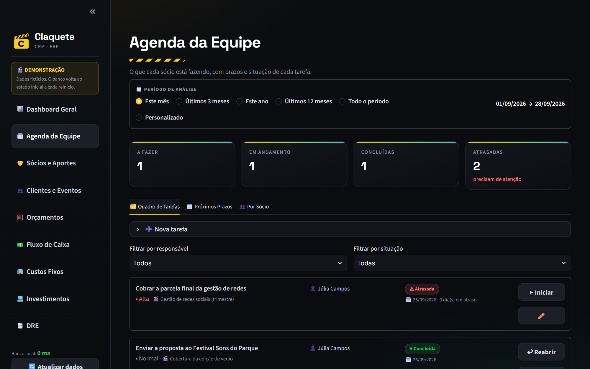
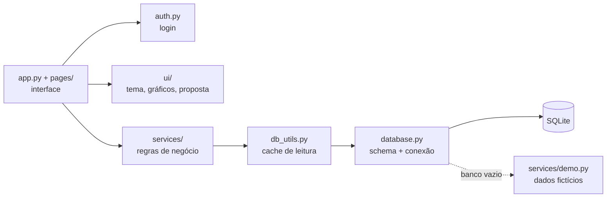

[English](README.md) · **Português**

# Claquete CRM/ERP

**CRM e gestão para pequenas produtoras audiovisuais: clientes, projetos, orçamentos e propostas, aportes dos sócios, fluxo de caixa, custos fixos, equipamentos, agenda da equipe e DRE automático. Feito em Python, Streamlit e SQLite.**

[](https://claquete-crm.streamlit.app)




> **Dados fictícios.** Esta é a versão pública de um sistema em uso diário numa produtora audiovisual com três sócios. Nome e marca da empresa, sócios, clientes, e-mails, telefones e todos os valores foram trocados por dados gerados por [`services/demo.py`](services/demo.py). Nenhuma informação do cliente está neste repositório.

> **A interface é em português do Brasil**, porque o sistema foi feito para uma empresa brasileira (valores em R$, datas em DD/MM/AAAA, termos fiscais brasileiros).

## Demonstração online

**[Abrir a demonstração](https://claquete-crm.streamlit.app)**

| Usuário | Senha |
|---|---|
| `demo` | `claquete` |

Pode cadastrar, editar e excluir à vontade. O banco volta ao estado inicial sempre que o servidor reinicia.

Se ninguém abriu a demo há algum tempo, o Streamlit mostra a tela *"This app has gone to sleep"*. Clique em **Yes, get this app back up!** e aguarde uns 30 segundos.

---

## O problema

A produtora era gerida por uma planilha e um grupo de mensagens. Os três sócios pagavam despesas da empresa do próprio bolso, ninguém sabia quanto a empresa devia a cada um, os orçamentos eram refeitos à mão para cada cliente e o lucro real do mês era um chute.

## A solução

Um sistema web que os sócios abrem de qualquer navegador. Cada aporte, pagamento, custo e projeto é registrado uma vez, e o sistema monta o resto sozinho: quanto a empresa deve a cada sócio, saldo de caixa, valores a receber, contas fixas de cada mês, o DRE e propostas prontas para enviar ao cliente.

## Funcionalidades

| Tela | O que faz |
|---|---|
| **Dashboard** | Caixa atual, entradas e saídas do período, valores a receber, dívida com sócios, evolução do caixa em 12 meses, saídas por categoria, receita por cliente e funil de projetos. |
| **Agenda da equipe** | Quadro de tarefas por status, próximos prazos e carga por sócio. "Atrasada" é calculado pelo prazo, nunca gravado. |
| **Sócios e aportes** | Aportes em dinheiro, despesas pagas do próprio bolso e reembolsos. O saldo devedor de cada sócio está sempre atualizado. |
| **Clientes e eventos** | CRM enxuto: clientes, projetos com status, recebimentos parcelados e links para contratos e notas fiscais. |
| **Orçamentos** | Horas × pessoas × valor, com tabela de preços, desconto e valor-hora efetivo. Gera a proposta em A4 pronta para imprimir ou salvar em PDF. |
| **Fluxo de caixa** | Livro-razão único de todas as entradas e saídas reais, com lançamentos manuais e filtros. |
| **Custos fixos** | Custos recorrentes, contas de cada mês geradas automaticamente, controle de pago/em aberto. |
| **Investimentos** | Compra de equipamentos e softwares, pagos pelo caixa ou por um sócio (que vira aporte a reembolsar). |
| **DRE** | Demonstrativo de resultado em regime de caixa, por mês e por ano, com margem e um aviso quando a margem sugere custos não lançados. |

<table>
<tr>
<td></td>
<td></td>
</tr>
<tr>
<td></td>
<td></td>
</tr>
</table>

Mais prints em [`docs/`](docs/).

---

## Decisões técnicas

### Cache de leitura com invalidação na gravação
O Streamlit reexecuta a página inteira a cada clique. Em produção o banco fica na nuvem, então cada consulta é uma ida e volta pela internet. Toda leitura passa por [`db_utils.py`](db_utils.py), que guarda o resultado na memória do servidor. A regra que mantém os dados corretos é simples: **qualquer gravação (incluir, editar, excluir) apaga o cache inteiro**. O sistema roda num único servidor compartilhado pelos sócios, então o que um grava aparece para todos no clique seguinte. Um prazo de 90 segundos cobre alterações feitas por fora do sistema. Os resultados são copiados na entrada e na saída do cache, para que uma tela que acrescenta campos a um resultado nunca "suje" o que está guardado.

Junto com isso: a conexão é reaproveitada por thread e renovada depois de 45 segundos parada (sem "ping" antes de cada consulta), consultas que rodavam em laço foram agrupadas (DRE, dívidas, orçamentos) e o schema é conferido uma única vez por processo.

### Propostas congeladas por versão
Emitir uma proposta grava uma **cópia congelada do documento HTML completo** em `propostas_emitidas`, com número de versão. Se o orçamento mudar depois, a proposta que o cliente recebeu continua no histórico exatamente como foi enviada, e uma nova emissão vira a revisão 2, 3… O logo é trocado por um marcador antes de gravar, para não se repetir em todas as linhas.

### Proteção contra XSS
Várias telas montam HTML para aplicar a identidade visual. Todo texto vindo do banco ou digitado por alguém passa por `theme.esc()` (`html.escape`) antes de chegar ao `unsafe_allow_html`, e o documento da proposta escapa todos os campos do mesmo jeito. Links de documentos só aceitam `http://` e `https://` depois de normalizados, então links `javascript:` e `data:` são recusados. A análise completa está em [`SEGURANCA.md`](SEGURANCA.md).

### Senhas com hash PBKDF2
As senhas nunca são gravadas. O [`auth.py`](auth.py) guarda um hash `pbkdf2_sha256` com 200 mil iterações e sal aleatório por senha, e compara com `hmac.compare_digest` (tempo constante). A sessão expira depois de 4 horas sem uso, e o login bloqueia depois de 5 tentativas erradas. Até a senha da demonstração segue o mesmo caminho: vira hash uma vez ao iniciar, e o login compara hashes.

### Outras decisões
- **Regras de negócio em `services/`**; as páginas só cuidam da interface. Os services são Python puro e podem ser usados em scripts (veja `scripts/gerar_custos_do_mes.py`).
- **Mudanças de schema que funcionam em banco com dados:** `CREATE TABLE IF NOT EXISTS` mais uma lista de colunas novas aplicadas com `ALTER TABLE` (idempotente).
- **DRE em regime de caixa:** aportes e reembolsos dos sócios aparecem à parte, como financiamento, e não como resultado operacional.
- **Demonstração que se reinicia sozinha:** quando o banco abre vazio, o `init_db()` carrega os dados fictícios com uma trava (duas sessões abrindo juntas não duplicam os dados). O Streamlit Community Cloud apaga o disco a cada reinício, então a demo volta ao início por conta própria. As datas da demo são relativas a hoje, então ela sempre abre com números atuais.
- **Dependências com versão fixa** no `requirements.txt`, para a demo não quebrar numa atualização de biblioteca.

## Arquitetura



## Como rodar localmente

Precisa de Python 3.11 ou mais novo.

```bash
git clone https://github.com/alissonlittig/claquete-crm.git
cd claquete-crm
python -m venv venv
# Windows: venv\Scripts\activate    |    Mac/Linux: source venv/bin/activate
pip install -r requirements.txt
streamlit run app.py
```

Abra `http://localhost:8501` e entre com `demo` / `claquete`. O banco (`data/claquete_demo.db`) é criado e preenchido na primeira execução. Para voltar ao estado inicial a qualquer momento:

```bash
python scripts/seed_demo.py
```

No Windows, depois de instalar, dá para abrir com dois cliques em `abrir_sistema_windows.bat` (no Mac/Linux, `abrir_sistema_mac_linux.command`).

Para usar senhas próprias no lugar do login de demonstração, gere o hash com `python scripts/gerar_senha.py` e siga o [`.streamlit/secrets.toml.example`](.streamlit/secrets.toml.example).

## Estrutura do projeto

```
app.py                 dashboard (página inicial)
pages/                 uma tela por arquivo
services/              regras de negócio (sócios, projetos, financeiro, DRE, orçamentos, tarefas, dados da demo)
ui/                    tema, gráficos Plotly, componentes de formulário, documento da proposta
database.py            schema, conexão, migrações
db_utils.py            consultas, cache de leitura, formatação brasileira
auth.py                login, hash PBKDF2, expiração de sessão
scripts/               seed, hash de senha, gerador do logo, custos fixos do mês
docs/                  prints das telas
```

O logo da Claquete é gerado por código ([`scripts/gerar_logo.py`](scripts/gerar_logo.py)), sem nenhuma imagem de origem.
